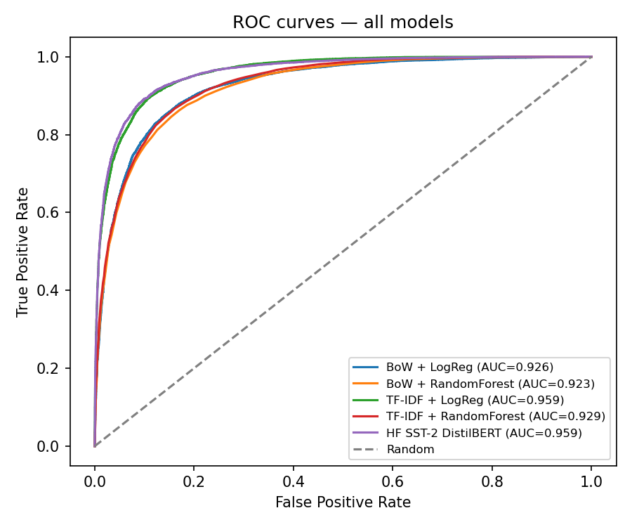
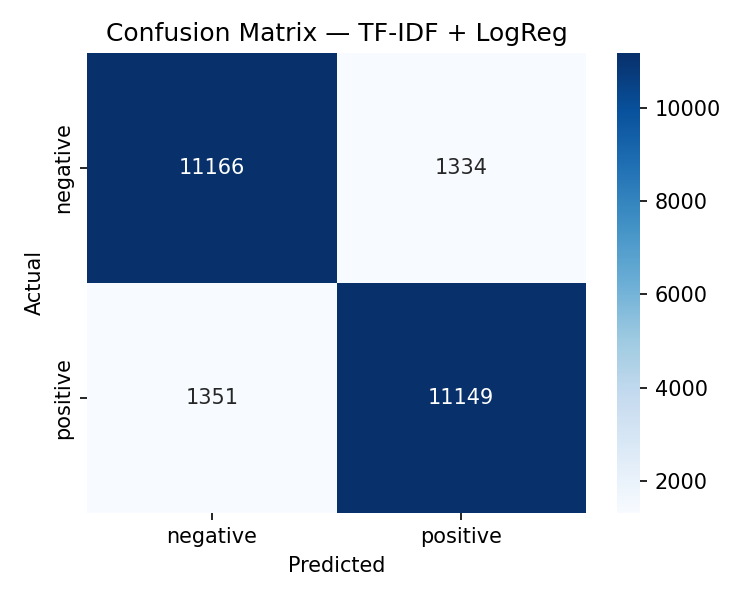
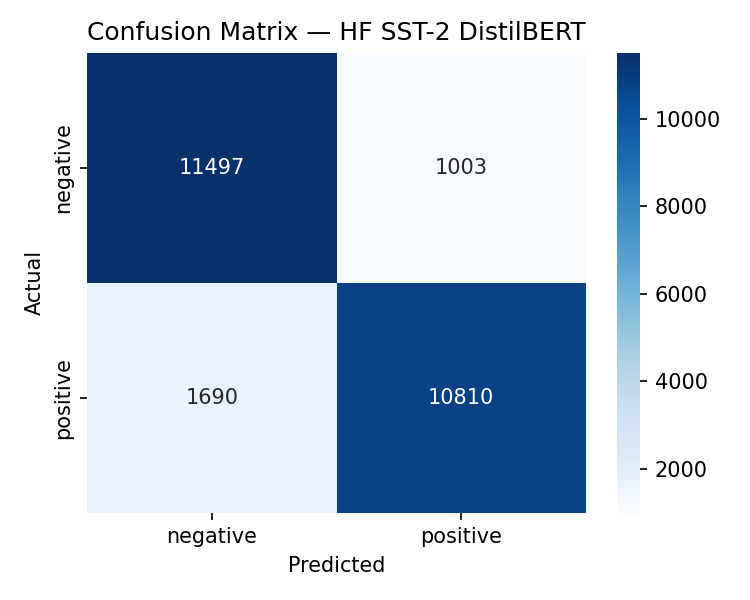

# IMDb Movie Review Sentiment Analysis

**Author:** Panagiotis Kounelis

Binary sentiment classification of movie reviews (positive vs negative) using the [Stanford IMDb dataset](https://huggingface.co/datasets/stanfordnlp/imdb) via HuggingFace.

## Problem

Given the text of an IMDb movie review, predict whether the sentiment is **negative** (0) or **positive** (1).

## Dataset

- **Source:** [`stanfordnlp/imdb`](https://huggingface.co/datasets/stanfordnlp/imdb) (25k train + 25k test)
- **Splits:** HF `train` → 85% `train_fit` + 15% `val`; HF `test` held out for final evaluation
- **Features:** review text only
- **Processed files:** `python -m src.preprocess` writes `data/processed/train_fit.csv`, `val.csv`, and `test.csv` (gitignored; no manual download needed)
- **Sklearn text column:** lowercase + HTML strip (`text_sklearn`)
- **Sentiment model text column:** light HTML strip only (`text_sentiment`)

## Pipeline

1. **`preprocess.py`** — load `stanfordnlp/imdb`, clean text, split into `train_fit` / `val` / `test`, save CSVs under `data/processed/`
2. **`train_sklearn.py`** — train BoW and TF-IDF pipelines on `train_fit`; GridSearchCV for TF-IDF models; save `.pkl` files to `models/`
3. **`evaluate.py`** — run all sklearn models and the pretrained HF SST-2 DistilBERT on the held-out test set; write `test_results.json` and plots to `models/plots/`

Optional: explore the data first in `notebooks/eda.ipynb`.

## Setup

```bash
cd Projects/IMDb-Review-Sentiment
conda activate bb_env_gpu   # or your env with torch + CUDA
pip install -r requirements.txt
```

Use the **same environment** for training and evaluation so scikit-learn model pickles stay compatible (`scikit-learn==1.7.2` is pinned in `requirements.txt`).

## Run

```bash
python -m src.preprocess
python -m src.train_sklearn   # Pipelines + GridSearchCV
python -m src.evaluate        # sklearn + pretrained HF sentiment model
```

The HF model ([`distilbert-base-uncased-finetuned-sst-2-english`](https://huggingface.co/distilbert-base-uncased-finetuned-sst-2-english)) is downloaded automatically on first evaluation — no fine-tuning step.

Or explore data first in `notebooks/eda.ipynb`.

## Models

| Model | Description |
|-------|-------------|
| CountVectorizer + LogReg | **Baseline** — bag-of-words with no hyperparameter tuning |
| CountVectorizer + RandomForest | **Baseline** — bag-of-words with default RandomForest |
| TF-IDF + LogReg | TF-IDF with GridSearchCV over `C` |
| TF-IDF + RandomForest | TF-IDF with GridSearchCV over `max_depth` and `n_estimators` |
| HF SST-2 DistilBERT | Pretrained [`distilbert-base-uncased-finetuned-sst-2-english`](https://huggingface.co/distilbert-base-uncased-finetuned-sst-2-english) — zero-shot inference on IMDb reviews |

All sklearn models use `sklearn.pipeline.Pipeline` (vectorizer + classifier saved as one artifact).

## Results

Test-set metrics on the held-out HuggingFace **test** split (25,000 reviews).

| Model | F1 (macro) | Accuracy | ROC-AUC |
|-------|------------|----------|---------|
| TF-IDF + LogReg (tuned, C=10) | **0.89** | **0.89** | 0.96 |
| HF SST-2 DistilBERT (pretrained) | 0.89 | 0.89 | **0.96** |
| BoW + LogReg (baseline) | 0.85 | 0.85 | 0.93 |
| TF-IDF + RandomForest (tuned) | 0.85 | 0.85 | 0.93 |
| BoW + RandomForest (baseline) | 0.85 | 0.85 | 0.92 |

**Best model on test:** TF-IDF + LogReg (F1 = 0.89). Metrics are also in `models/test_results.json`. Run `python -m src.evaluate` to refresh.

### Plots

Combined ROC curves:



Per-model confusion matrices:

| BoW + LogReg | BoW + RandomForest |
|:---:|:---:|
|  |  |

| TF-IDF + LogReg | TF-IDF + RandomForest |
|:---:|:---:|
|  |  |

| HF SST-2 DistilBERT |
|:---:|
|  |

## Project structure

```
IMDb-Review-Sentiment/
├── data/processed/     # train_fit.csv, val.csv, test.csv (gitignored)
├── notebooks/eda.ipynb
├── src/
│   ├── config.py
│   ├── text_clean.py
│   ├── preprocess.py
│   ├── train_sklearn.py
│   ├── hf_sentiment.py
│   └── evaluate.py
├── models/
│   ├── plots/          # confusion matrices + ROC (tracked in git)
│   ├── *.pkl           # sklearn pipelines (gitignored)
│   └── test_results.json
├── requirements.txt
└── README.md
```

## Future work

- **Stronger hyperparameter search** — Optuna or broader GridSearchCV grids for TF-IDF + LogReg / RandomForest.
- **Fine-tune a transformer on `train_fit` only** — fair comparison with sklearn; likely beats TF-IDF + LogReg on full IMDb reviews.
- **Model interpretability** — SHAP or LIME for TF-IDF coefficients and transformer attention patterns.
